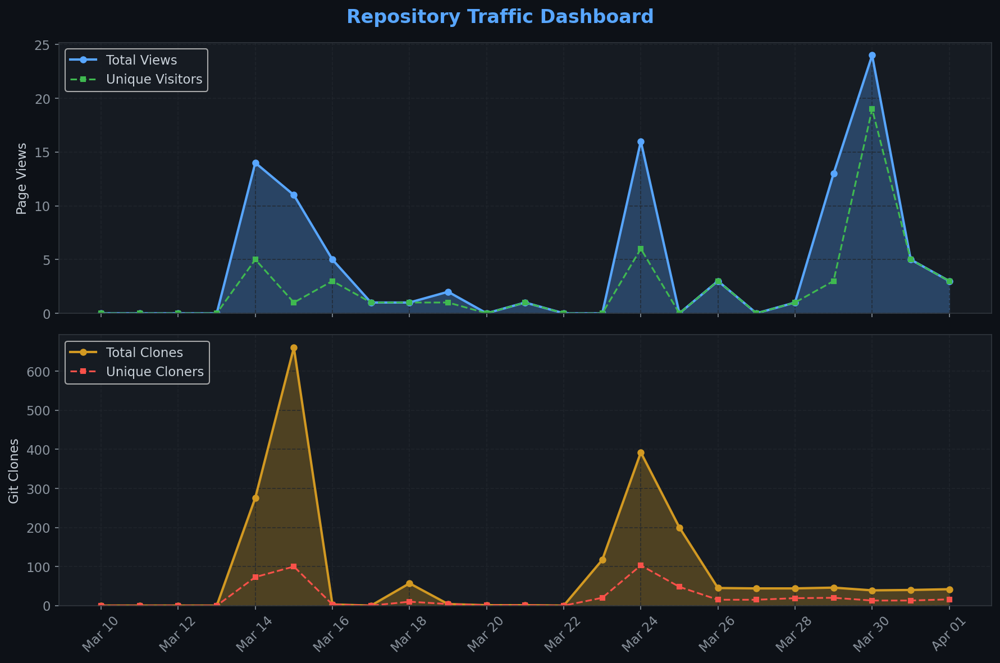
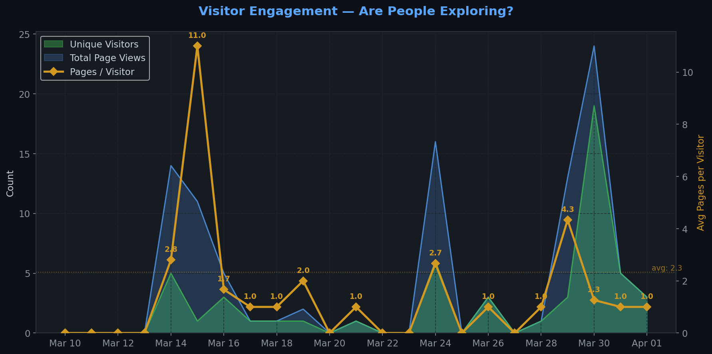
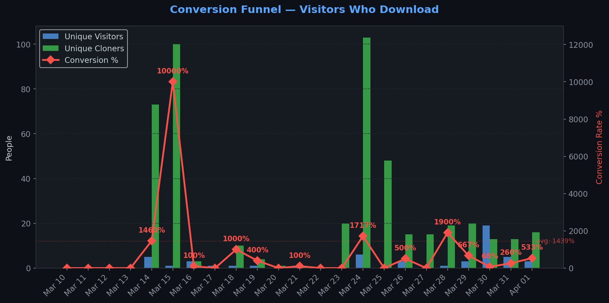
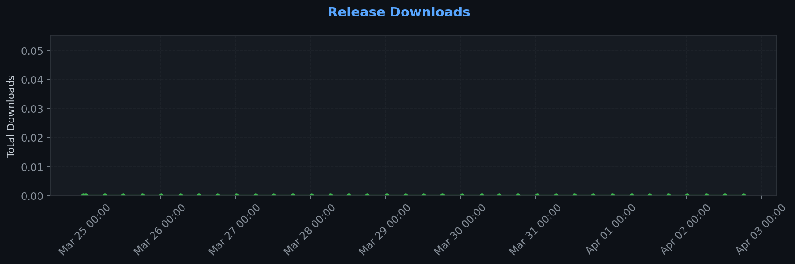
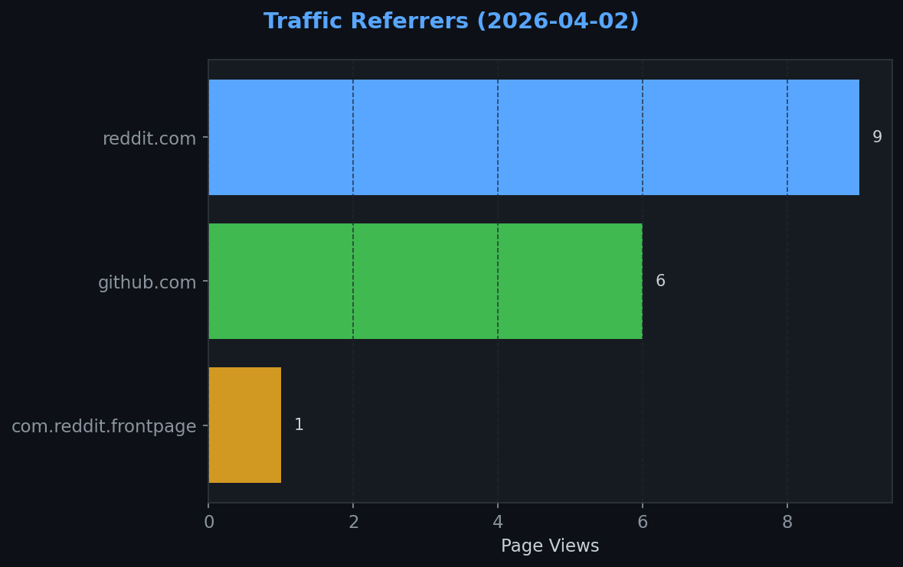
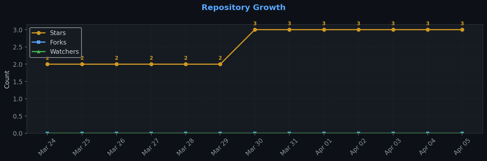

# Repository Traffic Dashboard

**Last updated:** 2026-04-02T18:16:20Z
**Days tracked:** 10 | **Download snapshots:** 37 (hourly)

---

## Views & Clones (14-day window, preserved forever)

| Metric | 14-Day Total | Unique |
|--------|-------------|--------|
| Page Views | 68 | 39 |
| Git Clones | 1015 | 252 |

> **Engagement:** 1.7 pages per visitor (14-day avg)

---

## Visitor Engagement

> Higher = visitors exploring more pages. 1.0 = bounce. 3.0+ = deeply engaged.

---

## Conversion Funnel

> **14-day conversion:** 252 of 39 visitors cloned or downloaded (**646.1%**)
>
> Unique cloners: 252 | Release downloads: 0

---

## Total Acquisition per Release (Downloads + Clones)

| Channel | Count |
|---------|-------|
| Zip Downloads | 0 |
| Git Clones (14-day) | 1015 |
| **Total Acquisitions** | **1015** |

---

## Referrers

| Source | Views | Unique |
|--------|-------|--------|
| reddit.com | 9 | 8 |
| github.com | 6 | 5 |
| com.reddit.frontpage | 1 | 1 |

---

## Repository Growth

| Metric | Current |
|--------|---------|
| Stars | 3 |
| Forks | 0 |
| Watchers | 0 |

---

## Top Pages (14-day)

| Page | Views | Unique |
|------|-------|--------|
| `/XelaNull/pushling` | 37 | 30 |
| `/XelaNull/pushling/blob/main/README.md` | 3 | 3 |
| `/XelaNull/pushling/tree/main/scripts` | 3 | 2 |
| `/XelaNull/pushling/blob/main/PUSHLING_VISION.md` | 2 | 2 |
| `/XelaNull/pushling/blob/main/build.sh` | 2 | 2 |
| `/XelaNull/pushling/issues/1` | 2 | 2 |
| `/XelaNull/pushling/tree/main/.github/workflows` | 2 | 2 |
| `/XelaNull/pushling/tree/main/mcp` | 2 | 2 |
| `/XelaNull/pushling/tree/main/mcp/src` | 2 | 2 |
| `/XelaNull/pushling/blob/main/.github/workflows/traffic-stats.yml` | 2 | 1 |

---

## Data Files

| File | Description | Granularity |
|------|-------------|-------------|
| [daily.json](daily.json) | Views & clones per day (never expires) | Daily |
| [downloads.json](downloads.json) | Release download snapshots | Hourly |
| [referrers.json](referrers.json) | Referrer snapshots | Daily |
| [metadata.json](metadata.json) | Stars, forks, watchers | Daily |
| [stats.json](stats.json) | Combined legacy snapshots | 6-hourly |

---
*Hourly download tracking + full dashboard with engagement metrics every 6 hours*
*Auto-generated by [traffic-stats.yml](../../.github/workflows/traffic-stats.yml)*
